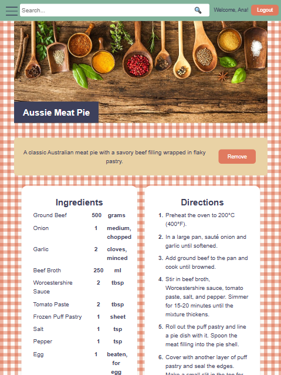
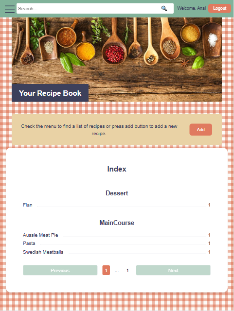

# My Recipes Project

## Overview
A comprehensive personal recipe management application with a robust C# backend and modern web API architecture.




## Project Structure
```
my_recipes/
│
├── .github/           # GitHub workflow and CI/CD configurations
├── .git/              # Git version control directory
└── my_recipes/        # Main project directory
    ├── Controllers/   # API endpoint controllers
    ├── Models/        # Data models and entity definitions
    ├── Services/      # Business logic and data processing
    ├── Repositories/  # Data access and database interactions
    └── appsettings.json  # Configuration settings
```

## Backend Technology Stack
- **Language**: C# (.NET Core)
- **Web Framework**: ASP.NET Core Web API
- **ORM (Object-Relational Mapping)**: Entity Framework Core
- **Database**: SQL Server
- **API Documentation**: Swagger/OpenAPI

## Key Backend Features
- RESTful API design
- Entity Framework for database interactions
- Dependency Injection
- Comprehensive error handling
- Swagger API documentation

## Development Environment Setup

### Prerequisites
- [.NET SDK 6.0 or later](https://dotnet.microsoft.com/download)
- [Visual Studio 2022](https://visualstudio.microsoft.com/) or [Visual Studio Code](https://code.visualstudio.com/)
- [SQL Server](https://www.microsoft.com/en-us/sql-server/sql-server-downloads)

### Installation Steps
1. Clone the repository
   ```bash
   git clone https://github.com/yourusername/my-recipes.git
   ```

2. Open the solution in Visual Studio
   - Open `my_recipes.sln`
   - Restore NuGet packages

3. Configure Database Connection
   - Update connection string in `appsettings.json`
   ```json
   {
     "ConnectionStrings": {
       "DefaultConnection": "Server=localhost;Database=MyRecipesDB;Trusted_Connection=True;"
     }
   }
   ```

4. Run Database Migrations
   ```bash
   dotnet ef database update
   ```

## Running the Application
- **In Visual Studio**: Press F5 or use Debug > Start Debugging
- **Command Line**: 
  ```bash
  dotnet run
  ```

## API Endpoints
- Swagger UI: `https://localhost:44369/swagger/index.html`
- API Base URL: `https://localhost:44369/api/recipe`

### Available Endpoints
- `GET /api/recipe`: Retrieve all recipes
- `GET /api/recipe/{id}`: Get a specific recipe
- `POST /api/recipe`: Create a new recipe
- `PUT /api/recipe/{id}`: Update an existing recipe
- `DELETE /api/recipe/{id}`: Delete a recipe

## Logging and Monitoring
- Integrated logging using built-in .NET Core logging
- Support for various log levels (Debug, Information, Warning, Error)

## Contributing
Feel free to suggest improvements.

## License
[Specify your license here]

## Contact
[Your contact information]
